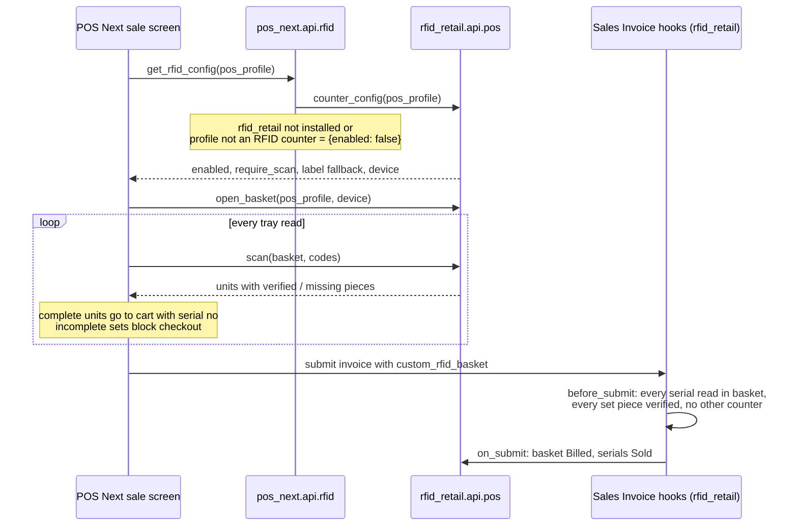

# What this fork adds to POS Next

This fork tracks [BrainWise-DEV/POSNext](https://github.com/BrainWise-DEV/POSNext) `develop`.
Branch `feat/rfid-mode` adds the changes below. Each one is off by default or falls back to the
upstream behaviour, so a site that does not use a feature sees no difference.

## 1. RFID counter mode (optional)

Works together with the [rfid_retail](https://github.com/tushar-git26/rfid_retail) app. For
garment stores where every piece carries an RFID tag and a set (suit = jacket + trouser) must
only be billed when every piece is at the counter.

- **Tray panel** above the cart (`RfidTray.vue`) shows what the tray reader sees: each sellable
  unit with its pieces marked as read or missing.
- **Complete units go into the normal cart** with their serial numbers. Incomplete sets stay in
  the panel and **block checkout** until the missing pieces are read or the set is removed.
- **No hand-picking**: when the counter requires a scan, a tagged (serial) item cannot be added
  from the item grid or by search.
- **Resumes after reload**: the open basket is kept on the server and reloaded with the shift.
- **Online only**: checkout on an RFID counter is blocked while offline.
- Every other POS Profile, and every site without `rfid_retail`, works exactly as before.

Files: `POS/src/components/sale/RfidTray.vue`, `POS/src/stores/posRfid.js`,
`pos_next/api/rfid.py`, small hooks in `POSSale.vue`, `useInvoice.js` and `posCart.js`.
`useInvoice` gained a generic `invoiceExtras` ref, so any optional module can put extra header
fields on the invoice. RFID mode uses it for `custom_rfid_basket`.

## 2. Per-item GST (Item Tax Template)

- **Each cart line is taxed at its own Item Tax Template rate**, the same way ERPNext calculates
  the saved invoice. Before this change the POS applied the profile's flat rate (e.g. 18%) to
  every line, so a 5% item showed 18% and, in tax-exclusive mode, the grand total was wrong.
  New endpoint `get_item_tax_templates`. Sites without Item Tax Templates keep the flat rate.
- **HSN and tax breakup in the item details dialog**: HSN/SAC, template, CGST/SGST/IGST split
  with amounts, taxable value, total tax, inclusive/exclusive badge.
- Clicking the backdrop closes the item details dialog.

## 3. Item SKU display

- **Display Item SKU** checkbox in POS Settings. When on, the item list shows the Item's
  `custom_sku` (table column, or under the name in card view). The API only reads the field if
  it exists on the site.
- The SKU also shows in its own column in the Invoice Details dialog.

## 4. Fixes

- **Item Price validity dates**: barcode search, variants, item grid and bulk load now ignore
  expired or future Item Prices and pick the newest valid one, like ERPNext's `get_item_price`.
  Before, the price shown depended on whatever row the database returned last.
- **EOD report print**: closing a shift no longer tries to print through QZ Tray (and shows
  "EOD report did not print") when Silent Print is off.

## How POS Next and rfid_retail work together

The two apps do not depend on each other at install time. POS Next only has a thin bridge
(`pos_next/api/rfid.py`). `rfid_retail` owns all tag data and rules.



1. **Turn it on**: in `rfid_retail`, enable RFID Settings, tick **RFID Counter** on the POS
   Profile, and link a Tray Reader `RFID Device` to that profile.
2. **Detect**: when a shift opens, POS Next calls `pos_next.api.rfid.get_rfid_config`. That
   method returns `{enabled: false}` unless `rfid_retail` is installed. If it is installed, it
   returns `rfid_retail.api.pos.counter_config`.
3. **Scan**: the tray panel calls `rfid_retail.api.pos.open_basket`, `scan`, `remove_unit` and
   `cancel_basket`. Reads are stored in an `RFID Basket` on the server, so they survive a reload
   and no two counters can hold the same unit.
4. **Bill**: POS Next submits its invoice through its normal flow, with `custom_rfid_basket` set
   on the header. `rfid_retail`'s `before_submit` hook checks every unit again: the serial must
   be read in that basket, every piece of a set must be verified, and the unit must not be on
   another open counter. The frontend cannot skip these checks. `on_submit` marks the basket
   Billed and the serials Sold. Cancel or return reverses that.

## Install

```bash
bench get-app https://github.com/tushar-git26/POSNext --branch feat/rfid-mode
bench --site <site> install-app pos_next
# optional, for RFID counters
bench get-app https://github.com/tushar-git26/rfid_retail --branch main
bench --site <site> install-app rfid_retail
```
